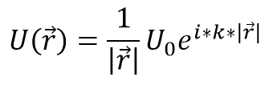

:doc:`index`

======
Theory
======

Mathematical model overview
---------------------------

Consider a a single, dimensionless, omnidirectional monopole wave radiator
emitting a continuous wave at frequency f, phase phi, amplitude U0.

In the media of wave velocity v, the radiator produces a stationary disturbance of wavelength lambda, and wavenumber k.
The wave produced can be described at any time t and point r in space as a complex amplitude,
decaying proportionally to the area of the sphere of the radius R:

.. todo::

    Drawing here: 1, 2, 3D views of: point source, wave, point sampler, linear superposition

The contributions form multiple radiators undergo linear summation.

.. note::

    In the actual implementation, the above equation is extended with a model of transducer directionality, and a model of attenuation in air, and where applicable, a model of time-domain impulse response. The core idea remains tough.

The following simplyfying asumptions are made in most of handybeam (except where otherwise stated):

* The field is modelled as free-field, that is, no reflectors, no interfering probes e.t.c.; the boundary is at infinity and completely absorbing. see [#f3]_, [#f4]_ and [#f5]_

Notes on the propagator
-----------------------

The following inputs are required:

* Description of the propagation media: wavenumber :code:`k`; Note that the definition of wavenumber :code:`k` used here includes the :code:`tau` factor in order to avoid the in-kernel multiplication.
* Description of the radiating point sources: location :code:`XYZ`, amplitude :code:`A0` and phase :code:`phi0` of radiation, normal vector, and directivity function.
* Description of the points in space (pixels) to sample the acoustic field from - to calculate the resulting acoustic pressure.
* No-calculation zone radius. The radiator response is not calculated at distances closer than the specified radius to represent the assumption that one cannot measure transducer pressure response *inside* a transducer.

.. note::

    Despite the radiators being point-like, they physically represent perfectly baffled pistons of finite aperture; the effects of the aperture are expressed with the directivity function.

.. note::

    The currently implemented directivity function is appropriate for transducers that do not produce significant side lobes (that is, transducers of diameter approximately smaller than 1.5 wavelengths). Larger transducers can be simulated by combining output of multiple radiators distributed over an aperture.

The phase shift across space is described in terms of the medium's wavenumber :code:`k`.

The sampling points (image of the pressure field) can be described in either of two ways [#f1]_ :

1. A regular grid of pixels, aligned with the coordinate system, e.g. along XY plane; described by the XYZ location of a corner point (anchor), count of points along each direction, and the distance (spacing) between the sampling points(pixels).
2. An list of pixels, each described by an XYZ coordinate. In this case, the location of each pixel is arbitrary and does not need to follow any structure.

For each field sampling point, the pressure value is computed by summing the contributions from each radiator.

The contribution of a radiator is computed by shifting the radiator's phase by appropriate phase delay, (depends on the distance to radiator and medium wavenumber)
and reducing the radiator's amplitude by the model of decay of the amplitude over distance between the radiator and the sampling point.

The algorithm can be described in pseudo-code, as follows.

.. code-block:: python

    For each pixel:

        Initialize new pressure_accumulator=complex_zero;

        For each radiator:

            Distance = distance_between(radiator_position, pixel_position);

            # assume that wavenumber is homogenous across space.
            Phase_shift = wavenumber * Distance

            # note: energy spreads as area of sphere; amplitude spreads as square root of energy
            Amplitude_distance_decay_factor = 1 / Distance;

            Amplitude_attenuation_factor = use_attenuation_model(Distance)

            Amplitude_directivity_factor = use_transducer_directivity_model(radiator_position, radiator_normal, pixel_position)

            # combine amplitude and phase effects into given radiator's contribution
            Amplitude_contribution = radiator_amplitude * Amplitude_distance_decay_factor * Amplitude_attenuation_factor * Amplitude_directivity_factor

            Phase_contribution =  Phase_shift + radiator_phase;

            radiator_contribution = complex(Amplitude_contribution using Phase_shift)

            # accumulate the radiator's contribution
            pressure_accumulator=increment(pressure_accumulator with radiator_contribution)

        End for each radiator

        Output(pixel)=pressure_accumulator;

    End for each pixel

.. todo::

    Some references to external papers or books would be nice to have here.

Coordinate system and units
---------------------------

for HandyBeam, I will be using the "Ultrahaptics System". Typically, the transducer array centre will be placed in the centre of the global coordinate system, but this is not mandatory.

.. image:: _static\\coordinate_system.png
   :align: center
   :alt: Coordinate system

* **Distance** units are meters,
* **Frequency** units are Hertz,
* **transducer excitation** is in arbitrary linear unit from 0 to 1, where 1 means full power.
* **phase** is in radians, from -inf through -tau, 0, +tau [#f2]_ to +inf
* **time** units are seconds

In other words, we follow a sensible SI unit system, augmented with some practical adaptations.

Radiator directivity model
--------------------------

Classic model of directivity
~~~~~~~~~~~~~~~~~~~~~~~~~~~~

Classic model as published in popular papers

Cosine power model
~~~~~~~~~~~~~~~~~~~~~~~~~~~~

The cosine-power model -- not recommended anymore. Still available at low level via the "legacy" kernels.

R1 Poly2 model
~~~~~~~~~~~~~~~~~~~~~~~~~~~~

The poly2 model, used in Handybeam R1, is described in detail in :code:`HN21_calibrate_transducer_model.ipynb` file. use :code:`jupyter notebook` to see it.

Literature
----------

Pogo - finite element simulation package -- `pogo <http://www.pogo-fea.com/>`_

Common string operations in Python - `see this. <https://docs.python.org/3/library/string.html#formatstrings>`_

Sphinx and RST cheat sheet -- `see here. <https://thomas-cokelaer.info/tutorials/sphinx/rest_syntax.html#the-csv-table-directive>`_

----

.. rubric:: Footnotes

.. [#f1] the first approach is more computationally efficient if large count of pixels is demanded. The second approach can be more efficient than the first case if the demanded pixels do not follow a regular grid structure.

.. [#f2] 1 tau equals 2*pi; see `The Tau Manifesto <https://tauday.com/tau-manifesto>`_

.. [#f3] `BKSV Sound Intensity BR0476 document <https://www.bksv.com/media/doc/br0476.pdf>`_, page 6,

.. [#f4] `ISO 3745 <https://www.iso.org/standard/45362.html>`_

.. [#f5] In a free field, the module of intensity = pressure RMS squared / ( density * wave velocity ) : Abs(I) = p*p[rms] / (Rho*C) [pa*pa/(kg/m3 * m/s)]=[W/m2] as computed `here <https://www.wolframalpha.com/input/?i=Pa*Pa%2F(kg%2F(m*m*m)+*+m%2Fs)>`_

.. include:: footer_licence_note.rst

