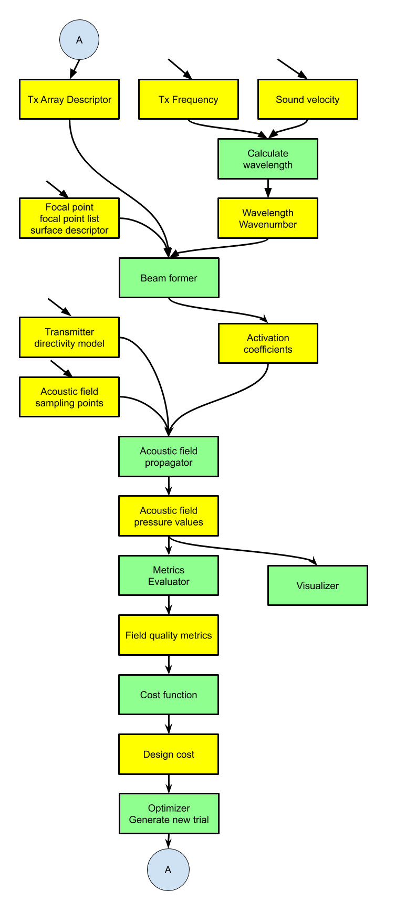

.. todo::

    This is an unfinished document

:doc:`index`

==============
Implementation
==============

Introduction
-------------------

Data flow diagram
~~~~~~~~~~~~~~~~~~~~~~~~~~~~~~

Data Structures
-------------------

Tx Array Descriptor
~~~~~~~~~~~~~~~~~~~~~~~~~~~~~~~~~~~~~~~~~~~~~~~~~~~~~~~~~~~~

.. TODO:: to do.

Tx Frequency
~~~~~~~~~~~~~~~~~~~~~~~~~~~~~~~~~~~~~~~~~~~~~~~~~~~~~~~~~~~~

.. TODO:: to do.

Sound Velocity
~~~~~~~~~~~~~~~~~~~~~~~~~~~~~~~~~~~~~~~~~~~~~~~~~~~~~~~~~~~~

.. TODO:: to do.

Focal point descriptor
~~~~~~~~~~~~~~~~~~~~~~~~~~~~~~~~~~~~~~~~~~~~~~~~~~~~~~~~~~~~

.. TODO:: to do.

Focal point list descriptor
~~~~~~~~~~~~~~~~~~~~~~~~~~~~~~~~~~~~~~~~~~~~~~~~~~~~~~~~~~~~

.. TODO:: to do.

Surface descriptor
~~~~~~~~~~~~~~~~~~~~~~~~~~~~~~~~~~~~~~~~~~~~~~~~~~~~~~~~~~~~

.. TODO:: to do.

Wavelength and wavenumber
~~~~~~~~~~~~~~~~~~~~~~~~~~~~~~~~~~~~~~~~~~~~~~~~~~~~~~~~~~~~

.. TODO:: to do.

Activation coefficients
~~~~~~~~~~~~~~~~~~~~~~~~~~~~~~~~~~~~~~~~~~~~~~~~~~~~~~~~~~~~

.. TODO:: to do.

Transmitter directivity model
~~~~~~~~~~~~~~~~~~~~~~~~~~~~~~~~~~~~~~~~~~~~~~~~~~~~~~~~~~~~

.. TODO:: to do.

Acoustic field sampling points
~~~~~~~~~~~~~~~~~~~~~~~~~~~~~~~~~~~~~~~~~~~~~~~~~~~~~~~~~~~~

.. TODO:: to do.

Acoustic field pressure values
~~~~~~~~~~~~~~~~~~~~~~~~~~~~~~~~~~~~~~~~~~~~~~~~~~~~~~~~~~~~

.. TODO:: to do.

Field quality metrics
~~~~~~~~~~~~~~~~~~~~~~~~~~~~~~~~~~~~~~~~~~~~~~~~~~~~~~~~~~~~

.. TODO:: to do.

Design cost
~~~~~~~~~~~~~~~~~~~~~~~~~~~~~~~~~~~~~~~~~~~~~~~~~~~~~~~~~~~~

.. TODO:: to do.

Procedures
---------------

Calculate wavelength
~~~~~~~~~~~~~~~~~~~~~~~~~~~~~~~~~~~~~~~~~~~~~~~~~~~~~~~~~~~~

.. TODO:: to do.

Beam former
~~~~~~~~~~~~~~~~~~~~~~~~~~~~~~~~~~~~~~~~~~~~~~~~~~~~~~~~~~~~

.. TODO:: to do.

Acoustic field propagator
~~~~~~~~~~~~~~~~~~~~~~~~~~~~~~~~~~~~~~~~~~~~~~~~~~~~~~~~~~~~

.. TODO:: to do.

Metrics evaluator
~~~~~~~~~~~~~~~~~~~~~~~~~~~~~~~~~~~~~~~~~~~~~~~~~~~~~~~~~~~~

.. TODO:: to do.

Field visualizer
~~~~~~~~~~~~~~~~~~~~~~~~~~~~~~~~~~~~~~~~~~~~~~~~~~~~~~~~~~~~

.. TODO:: to do.

Cost function
~~~~~~~~~~~~~~~~~~~~~~~~~~~~~~~~~~~~~~~~~~~~~~~~~~~~~~~~~~~~

.. TODO:: to do.

-------------

Among them, the reasoning behind the OpenCL implementation.

* Introduction to a modern GPU architecture (2012)
* How do we exploit the GPU architecture [#f1]_.

.. rubric:: Footnotes

.. [#f1] This is an example of a foot note.

.. include:: footer_licence_note.rst